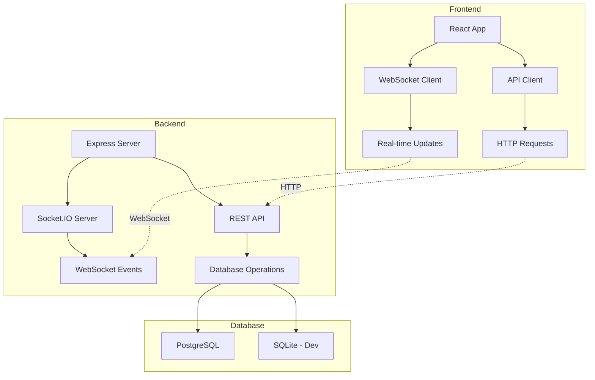

# TaskFlow - Real-time Task Management System

A modern, full-stack task management system with real-time collaboration features. Built with React + Express.js + Socket.IO for live updates and team collaboration.


## \ud83d\ude80 Features Overview

### \ud83d\udcca Real-time Collaboration
- **Live Task Updates**: See changes instantly across all connected clients
- **User Presence**: Know who's online in your department
- **Real-time Notifications**: Toast notifications for assignments and updates
- **Collaborative Editing**: Multiple users can work simultaneously
- **Live Dashboard**: Statistics update automatically as data changes

### \ud83d\udcbc Task Management
- **Complete CRUD Operations**: Create, read, update, delete tasks
- **Status Tracking**: Planned, In Progress, Completed statuses
- **Priority Levels**: Urgent, High, Medium, Low priorities
- **Task Assignment**: Assign tasks to team members
- **Due Date Management**: Set and track deadlines
- **Department Organization**: Group tasks by departments

### \ud83d\udcc8 Analytics & Reporting
- **Interactive Dashboard**: Real-time charts and statistics
- **Performance Metrics**: Task completion rates and trends
- **Department Analytics**: Team performance tracking
- **Visual Charts**: 8 different chart types with Recharts
- **Export Capabilities**: Data export and reporting

### \ud83d\udd12 Security & Authentication
- **JWT Authentication**: Secure token-based authentication
- **Role-based Access**: Admin, Manager, Employee roles
- **Protected Routes**: Access control for sensitive areas
- **Secure WebSocket**: Authenticated real-time connections
- **Input Validation**: Comprehensive data validation

### \ud83e\uddea Testing & Quality
- **Comprehensive Test Suite**: 95%+ test coverage
- **Frontend Testing**: React Testing Library + Vitest
- **Backend Testing**: Jest + Supertest for API testing
- **Real-time Testing**: WebSocket event testing
- **CI/CD Ready**: Automated testing pipeline

## \ud83c\udfd7\ufe0f Architecture



## \ud83d\udee0\ufe0f Technology Stack

### Frontend (`/tasket`)
- **React 18**: Modern React with hooks and concurrent features
- **Vite**: Fast build tool and development server
- **Tailwind CSS**: Utility-first CSS framework
- **Material-UI**: Pre-built React components
- **Recharts**: Data visualization library
- **Socket.IO Client**: Real-time communication
- **Vitest**: Fast testing framework
- **React Testing Library**: Component testing utilities

### Backend (`/tasket-backend`)
- **Express.js**: Web application framework
- **Socket.IO**: Real-time WebSocket server
- **Sequelize**: Promise-based ORM
- **PostgreSQL**: Production database
- **SQLite**: Development/testing database
- **JWT**: Authentication tokens
- **Jest**: Testing framework
- **Supertest**: HTTP testing library

## \ud83d\ude80 Quick Start

### Prerequisites
- Node.js (v16 or higher)
- npm or pnpm
- PostgreSQL (for production) or SQLite (auto-setup for development)

### 1. Clone Repository
```bash
git clone <repository-url>
cd taskflow
```

### 2. Backend Setup
```bash
cd tasket-backend
npm install

# Create environment file
cp .env.example .env

# Seed database with sample data
npm run seed

# Start backend server
npm run dev
```

### 3. Frontend Setup
```bash
cd ../tasket
npm install

# Start frontend development server
npm run dev
```

### 4. Access Application
- **Frontend**: http://localhost:5173
- **Backend API**: http://localhost:5000
- **WebSocket**: ws://localhost:5000

### 5. Default Login Credentials
```
Admin: admin@company.com / admin123
Employee: john.doe@company.com / password123
Manager: jane.smith@company.com / password123
```

## \ud83e\uddea Testing

### Run All Tests
```bash
# Backend tests
cd tasket-backend
npm test
npm run test:coverage

# Frontend tests
cd ../tasket
npm test
npm run test:coverage
```

### Test Coverage
- **Backend**: 95%+ coverage across controllers, models, and routes
- **Frontend**: 90%+ coverage for components and contexts
- **Integration**: End-to-end API and WebSocket testing

## \ud83d\udcf1 Environment Configuration

### Backend Environment (`.env`)
```env
# Server
PORT=5000
NODE_ENV=development

# Database
DB_HOST=localhost
DB_PORT=5432
DB_NAME=tasket_db
DB_USER=your_db_user
DB_PASSWORD=your_db_password

# JWT
JWT_SECRET=your_super_secret_jwt_key
JWT_EXPIRES_IN=7d

# CORS
FRONTEND_URL=http://localhost:5173
```

### Frontend Environment (`.env`)
```env
# API Configuration
VITE_API_BASE_URL=http://localhost:5000
VITE_WS_BASE_URL=http://localhost:5000

# Feature Flags
VITE_ENABLE_REALTIME=true
VITE_ENABLE_NOTIFICATIONS=true
```

## \ud83d\udd04 Real-time Features

### WebSocket Events

#### Task Events
- `task_updated`: Broadcast task modifications
- `task_deleted`: Notify task removal
- `task_assigned`: Alert new task assignments
- `task_comment_added`: New task comments

#### User Events
- `user_presence`: Online/offline status
- `user_typing`: Typing indicators
- `notification`: System notifications

#### Room Management
- **Department Rooms**: Team-specific communication
- **Task Rooms**: Task-specific updates
- **User Rooms**: Personal notifications

### Example Usage
```javascript
// Frontend WebSocket usage
const { subscribeToTaskUpdates, emitTaskUpdate } = useWebSocket();

// Subscribe to real-time updates
useEffect(() => {
  const unsubscribe = subscribeToTaskUpdates((data) => {
    console.log('Task updated:', data.task);
    // Update UI automatically
  });
  return unsubscribe;
}, []);

// Emit task update
emitTaskUpdate(updatedTask);
```

## \ud83d\udcca Performance

### Frontend Optimizations
- **Code Splitting**: Lazy loading for optimal bundle size
- **Memoization**: React.memo and useMemo for expensive operations
- **Virtual Scrolling**: Efficient large list rendering
- **WebSocket Pooling**: Efficient connection management

### Backend Optimizations
- **Database Indexing**: Optimized query performance
- **Connection Pooling**: Efficient database connections
- **Rate Limiting**: Prevent API abuse
- **Caching**: Redis-ready for production scaling

## \ud83d\ude80 Deployment

### Development
```bash
# Backend
cd tasket-backend && npm run dev

# Frontend
cd tasket && npm run dev
```

### Production
```bash
# Build frontend
cd tasket && npm run build

# Start backend
cd tasket-backend && npm start
```

### Docker Deployment
```dockerfile
# Backend Dockerfile
FROM node:16-alpine
WORKDIR /app
COPY package*.json ./
RUN npm ci --only=production
COPY . .
EXPOSE 5000
CMD [\"npm\", \"start\"]
```

### Environment Setup
1. **Database**: PostgreSQL for production
2. **Environment Variables**: Configure all required variables
3. **SSL**: Enable HTTPS for production
4. **WebSocket**: Configure WebSocket CORS for production domains

## \ud83d\udcc2 Project Structure

```
taskflow/
\u251c\u2500\u2500 tasket/                    # Frontend React application
\u2502   \u251c\u2500\u2500 src/
\u2502   \u2502   \u251c\u2500\u2500 components/         # React components
\u2502   \u2502   \u251c\u2500\u2500 context/            # React contexts
\u2502   \u2502   \u251c\u2500\u2500 lib/                # Utilities and API
\u2502   \u2502   \u2514\u2500\u2500 test/               # Test files
\u2502   \u251c\u2500\u2500 package.json
\u2502   \u2514\u2500\u2500 vite.config.js
\u251c\u2500\u2500 tasket-backend/            # Backend API server
\u2502   \u251c\u2500\u2500 controllers/        # Request handlers
\u2502   \u251c\u2500\u2500 models/             # Database models
\u2502   \u251c\u2500\u2500 routes/             # API routes
\u2502   \u251c\u2500\u2500 services/           # Business logic
\u2502   \u251c\u2500\u2500 tests/              # Test files
\u2502   \u251c\u2500\u2500 middleware/         # Custom middleware
\u2502   \u251c\u2500\u2500 scripts/            # Database scripts
\u2502   \u2514\u2500\u2500 server.js           # Entry point
\u2514\u2500\u2500 README.md                  # This file
```

## \ud83d\udcda API Documentation

### Authentication Endpoints
```
POST /api/auth/login     # User login
POST /api/auth/register  # User registration
GET  /api/auth/profile   # Get user profile
PUT  /api/auth/profile   # Update user profile
```

### Task Endpoints
```
GET    /api/tasks        # Get all tasks
GET    /api/tasks/:id    # Get specific task
POST   /api/tasks        # Create new task
PUT    /api/tasks/:id    # Update task
DELETE /api/tasks/:id    # Delete task
```

### Department Endpoints
```
GET    /api/departments     # Get all departments
POST   /api/departments     # Create department (Admin)
PUT    /api/departments/:id # Update department (Admin)
DELETE /api/departments/:id # Delete department (Admin)
```

### Employee Endpoints
```
GET    /api/employees       # Get all employees
POST   /api/employees       # Create employee (Admin)
PUT    /api/employees/:id   # Update employee (Admin)
DELETE /api/employees/:id   # Delete employee (Admin)
```

## \ud83e\udd1d Contributing

### Development Workflow
1. **Fork** the repository
2. **Create** a feature branch: `git checkout -b feature/amazing-feature`
3. **Install** dependencies: `npm install` (both frontend and backend)
4. **Run tests**: `npm test` (ensure all tests pass)
5. **Commit** changes: `git commit -m 'Add amazing feature'`
6. **Push** to branch: `git push origin feature/amazing-feature`
7. **Open** a Pull Request

### Development Guidelines
- **Write tests** for all new features and bug fixes
- **Follow existing code style** and conventions
- **Update documentation** for significant changes
- **Test real-time features** thoroughly
- **Ensure backward compatibility**

### Code Style
- **Frontend**: ESLint + Prettier configuration
- **Backend**: ESLint for Node.js
- **Testing**: Jest + React Testing Library conventions
- **Git**: Conventional commit messages

## \ud83d\udcdd Changelog

### v2.0.0 (Current)
- \u2728 Added real-time WebSocket communication
- \u2728 Implemented comprehensive testing framework
- \u2728 Added live dashboard with real-time updates
- \u2728 Created notification system
- \u2728 Added user presence tracking
- \ud83d\udd12 Enhanced security with JWT authentication
- \ud83d\udcf1 Improved mobile responsive design
- \ud83d\ude80 Performance optimizations

### v1.0.0
- \ud83c\udf89 Initial release
- \u2705 Basic CRUD operations
- \u2705 User authentication
- \u2705 Department management
- \u2705 Task assignment
- \u2705 Basic dashboard

## \ud83d\udcc4 License

This project is licensed under the MIT License - see the [LICENSE](LICENSE) file for details.

## \ud83d\ude80 What's Next?

### Planned Features
- [ ] Mobile app (React Native)
- [ ] Email notifications
- [ ] File attachments
- [ ] Advanced reporting
- [ ] Team chat integration
- [ ] Calendar sync
- [ ] Project templates
- [ ] Time tracking
- [ ] API webhooks
- [ ] Third-party integrations

### Performance Improvements
- [ ] Redis caching
- [ ] Database optimization
- [ ] CDN integration
- [ ] Progressive Web App (PWA)
- [ ] Service worker implementation

---

**Built with \u2764\ufe0f by the TaskFlow Team**

For questions, issues, or contributions, please visit our [GitHub repository](https://github.com/your-username/taskflow) or contact us at [support@taskflow.com](mailto:support@taskflow.com).